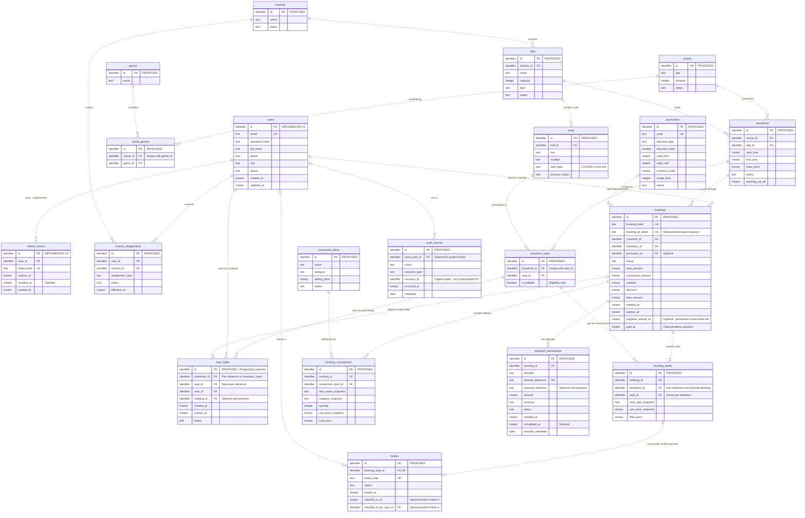

# Smart Cinema Canonical Logical ERD

Date: 2026-09-25  
Status: Canonical logical model applying the user-approved MVP decisions; proposed domain persistence is not implemented.

## 1. Canonical source and notation

The editable diagram source is [smart-cinema-logical-erd.mmd](smart-cinema-logical-erd.mmd). This document supplies its entity definitions, lifecycle cardinalities and constraints. The embedded Mermaid view below is an exact copy of that source; update the source and embedded view together. The existing `smart-cinema-erd.pdf` is a retained prior artifact, not the canonical source for this model.

There are **20 entities: 2 implemented Auth entities and 18 proposed domain entities**. Each box marks its status in the `id` comment. Only the User–Refresh Token relationship is implemented in the reviewed migrations. Every relationship to a proposed entity is proposed, even when it references `users`.

`||` means exactly one, `o|`/`|o` zero or one, `o{` zero or many, and `|{` one or many. Dotted connectors denote non-identifying relationships: each child has its own `id`. Connector style does not encode implementation status. Cardinalities describe valid retained business records, with lifecycle qualifications in §4.

`PK`, `FK` and `UK` denote logical primary identity, references and uniqueness. They do not prescribe SQL indexes or enforcement mechanisms. `identifier`, `text`, `instant`, `money`, `number`, `integer`, `boolean` and `data` are conceptual types, not SQL type/precision choices. Attributes shown focus on identities and transaction integrity; additional descriptive attributes are listed in §3. Optionality is explicit for relationships and key lifecycle fields; this is not an exhaustive SQL nullability specification.

## 2. Mermaid ERD

## 3. Entity inventory and implementation boundary

| Entity | Status | Purpose and additional attributes |
|---|---|---|
| `users` | Implemented V1 | One chain-wide account with the four supported roles; all nine migrated columns shown |
| `refresh_tokens` | Implemented V2 | Hashed authentication refresh credentials, expiry/revocation; all six migrated columns shown |
| `cinema_assignments` | Proposed | User–Cinema scope, assignment type/status/effective time; detailed interval/history policy deferred |
| `movies` | Proposed | Shared catalog; also description, release date, age rating, language, poster and trailer |
| `genres` | Proposed | Reusable Genre vocabulary, supported by FR-MOVIE-007 and genre management |
| `movie_genres` | Proposed | Movie–Genre association, without duplicate pairs |
| `cinemas` | Proposed | Physical branch; also address, contact and operating information |
| `halls` | Proposed | Screening room in one Cinema; capacity is people, not sellable-unit count |
| `seats` | Proposed | Stable physical sellable unit; STANDARD/VIP each one occupant, COUPLE an indivisible two-person unit |
| `showtimes` | Proposed | One Movie screening in one Hall, schedule/base price/cut-off |
| `showtime_seats` | Proposed | One Showtime/Seat pair and sale eligibility; no stored occupancy status |
| `seat_holds` | Proposed, PostgreSQL authoritative | Temporary owner/deadline and optional attachment to a Booking; Redis has no entity or authority |
| `bookings` | Proposed | Customer's one-Showtime transaction, frozen totals and one Booking QR identity |
| `booking_seats` | Proposed | Transaction lines for Seat Units, with type and pricing snapshots |
| `concession_items` | Proposed | Add-on catalog; also description, image, created_at and updated_at; no inventory |
| `booking_concessions` | Proposed | Purchased quantities, item/category snapshots, unit price and total |
| `promotions` | Proposed | Optional single Promotion per Booking; discount_value is a numeric rule value, potentially percentage or monetary according to discount_type, rather than always a currency amount |
| `payment_transactions` | Proposed | Attempts with immutable amount/currency/reference and provider evidence |
| `tickets` | Proposed | One Ticket per purchased Booking Seat; unique code and individual check-in state |
| `audit_records` | Proposed | Immutable action/actor/resource/time evidence; system-actor details remain deferred |

The Mermaid diagram uses `money` for amount concepts and `number` for Promotion's discount rule value; interpretation depends on discount type, with exact representation deferred. No separate Customer/Staff/Manager/Admin tables are needed: these are User roles. No separate QR, Check-in, Seat Unit, Redis, Payment Session or Basket Version entities are introduced. `cinema_assignments`, `movie_genres`, `showtime_seats`, `booking_seats` and `booking_concessions` are associative entities; Seat Hold is a temporal association with ownership.

### Existing Auth fidelity

V1 requires normalized unique email, nonblank credential/profile/status and one role in CUSTOMER/STAFF/MANAGER/ADMIN. SQL status is only nonblank; this ERD does not claim a migrated ACTIVE/BLOCKED constraint. Email is the selected login identifier; phone is not unique. `updated_at` is a migrated attribute, not proof of automatic updates by all writers.

V2 requires a User, unique nonblank token hash and expiry after creation; revocation is optional. Many refresh tokens per User are allowed. Hash format validation, token rotation and cleanup are not implied by the relationship. No business Hold refers to `refresh_tokens`. Refer to V1/V2 for existing physical definitions; none are changed or redesigned here.

## 4. References and cardinalities

Each FK below targets the parent's `id` unless a composite target is named. Required child references have exactly one parent. Parent-side zero permits an unused catalog/account/draft resource, not invalid children.

| Parent → child | Children per parent | Parents per child | Reference / qualification |
|---|---|---|---|
| User → Refresh Token | 0..N | 1 | `refresh_tokens.user_id`; implemented |
| User → Cinema Assignment | 0..N | 1 | `cinema_assignments.user_id` |
| Cinema → Cinema Assignment | 0..N | 1 | `cinema_assignments.cinema_id` |
| Cinema → Hall | 0..N | 1 | `halls.cinema_id` |
| Hall → Seat | 0..N | 1 | `seats.hall_id` |
| Movie → Movie Genre | 0..N | 1 | `movie_genres.movie_id` |
| Genre → Movie Genre | 0..N | 1 | `movie_genres.genre_id`; minimum Genres unspecified |
| Movie → Showtime | 0..N | 1 | `showtimes.movie_id` |
| Hall → Showtime | 0..N | 1 | `showtimes.hall_id` |
| Showtime → Showtime Seat | 0..N | 1 | `showtime_seats.showtime_id`; complete Hall membership before sales open |
| Seat → Showtime Seat | 0..N | 1 | `showtime_seats.seat_id` |
| Showtime Seat → Seat Hold | 0..N over time | 1 | `(showtime_id, seat_id)` pair reference |
| User → Seat Hold | 0..N | 1 | `seat_holds.user_id`; authenticated Customer owner |
| Booking → Seat Hold | 1..N for a created Booking | 0..1 | `seat_holds.booking_id`; one attached origin Hold per Booking Seat |
| User → Booking | 0..N | 1 | `bookings.customer_id`; Customer ownership |
| Showtime → Booking | 0..N | 1 | `bookings.showtime_id` |
| Promotion → Booking | 0..N | 0..1 | `bookings.promotion_id`; no promotion stacking |
| Booking → Booking Seat | 1..N | 1 | `booking_seats.booking_id`; empty Booking invalid |
| Showtime Seat → Booking Seat | 0..N over history | 1 | `(showtime_id, seat_id)` pair reference; at most one successful sale |
| Booking → Booking Concession | 0..N | 1 | `booking_concessions.booking_id`; add-ons optional |
| Concession Item → Booking Concession | 0..N | 1 | `booking_concessions.concession_item_id`; preserve master reference |
| Booking → Payment Transaction | 0..N | 1 | `payment_transactions.booking_id`; zero before payment initiation |
| Booking Seat → Ticket | 0..1 | 1 | `tickets.booking_seat_id`; exactly one after paid issuance |
| User → Ticket as check-in operator | 0..N | 0..1 | `tickets.checked_in_by_user_id`; present after successful check-in |
| User → Audit Record | 0..N | 0..1 | `audit_records.actor_user_id`; optional for system event |

The decision document allows Booking `0..N` Holds in a broad lifecycle diagram but also requires an origin Hold per Booking Seat. This canonical view specializes the minimum to `1..N` for valid created Bookings; it does not add an empty draft Booking state. Origin Hold references/history remain after consumption/expiry.

### Composite references and derived paths

- `showtime_seats` has PK `id` and a logically unique candidate pair `(showtime_id, seat_id)`.
- Both `seat_holds` and `booking_seats` reference that pair using their two shown FK components. Neither component is individually unique. No extra `showtime_seat_id` is assumed.
- `booking_seats.showtime_id` must equal the referenced Booking's `showtime_id`. An attached Hold's Showtime and User must equal the Booking's Showtime and Customer. Its Seat must match exactly one of that Booking's lines.
- Seat and Showtime must reference the same Hall. Two separate valid IDs alone do not establish valid membership.
- Ticket → Booking Seat → Booking and Ticket → Booking Seat → Seat are the authoritative paths. Booking `1 → 0..N` Tickets is derived, so no redundant Ticket `booking_id`/`seat_id` is drawn.
- Showtime/Seat → Holds and Seat → Booking Seats are also derived through the pair; direct duplicated connectors are omitted for readability.
- Booking/Ticket Cinema derives through Booking → Showtime → Hall → Cinema; User authorization depends on assignment scope, not a client-supplied branch ID.
- `audit_records.resource_type` plus `resource_id` is a logical resource reference, not an FK to arbitrary tables. System actor representation needs later detail; a null User actor must not mean unexplained attribution.

## 5. Important logical constraints

These express required outcomes only. This document selects no physical indexes, locking strategy, isolation level, partitioning, triggers or SQL enforcement mechanism.

### Identity and membership

- Every entity has one stable `id`; no duplicate Movie/Genre pair, Showtime/Seat pair, Seat location `(hall_id, row, number)`, or Booking/Seat line.
- Booking codes, Promotion lookup codes and internal payment references are logical unique identities adopted from the analysis proposals. Code normalization and provider-specific external reference uniqueness remain deferred; external_reference is deliberately not marked globally unique.
- Booking QR tokens and Ticket codes are unique (DR-010, DR-020–DR-021). `tickets.booking_seat_id` is unique for the approved one-Ticket-per-unit MVP; Ticket reissuance is deferred.
- No Hall/Seat/Showtime reparenting or overlapping physical-unit definitions may invalidate sales history. An H9-10 COUPLE unit must not coexist with independently sellable H9/H10 positions for the same fixture.
- Hall capacity counts people; COUPLE is one sellable unit and one Ticket. Ticket count is not an attendee count.

### Availability and ownership

- PostgreSQL is authoritative for Seat Holds. Each Showtime/Seat has at most one valid Hold and at most one successful sale (DR-006–DR-007). Historical expired/cancelled records may share the pair.
- `showtime_seats.is_sellable` records eligibility only. For a configured pair: PAID sale → BOOKED; otherwise physical/branch/Hall restrictions or disabled pair → UNAVAILABLE; otherwise valid Hold → HELD; otherwise AVAILABLE. Showtime status/cut-off separately governs whether booking is permitted.
- Missing pair membership is never implicitly AVAILABLE. Required membership must exist before opening sales.
- Multi-seat acquisition must be all-or-nothing. A Hold is usable only by its owner and strictly before its deadline; `expires_at > created_at` (DR-014). Delayed expiry processing must not make an expired Hold valid or release a replacement owner's Hold.
- Each Hold attaches to at most one Booking and cannot be reused for a second Booking. Booking expiry is no later than the earliest attached Hold expiry or Showtime cut-off. Starting/retrying Payment does not extend that deadline.
- Release/expiry affects the identified temporary ownership; it cannot erase paid seat ownership. Physical unavailability after sale does not silently cancel paid Tickets or perform a refund.
- `showtime.end_time > start_time` (DR-013); Hall schedules must not overlap under the configured buffer policy (BR-013/BR-014).

### Snapshots and Payment freeze

- Booking Seat snapshots Seat type, unit price and final price. Booking Concession snapshots item name, category, quantity, unit price and total. Catalog updates do not rewrite these values (DR-015–DR-016).
- Quantity > 0; concession line total = quantity × unit price before discount allocation (DR-017–DR-018). Booking subtotal = Seat Amount + Concession Amount; Final Amount = Subtotal − Discount and is nonnegative (DR-012). Discount allocation and rounding remain deferred; do not double-subtract allocated discounts.
- Supported pre-payment changes are allowed only for an eligible PENDING Booking whose `payment_started_at` is null. First payment initiation records the timestamp and freezes composition, promotion and totals permanently for that Booking, including after a failed attempt. It is not a new Booking status.
- Each attempt records its immutable amount/currency/reference. At most one unresolved attempt per Booking; retries use the frozen amount and first-attempt currency. Unknown gateway outcome does not authorize a new attempt or basket edit.
- PAID finalization requires trusted payment verification, matching reference/amount/currency, valid Booking entitlement and eligible Seat Units. Repeated results cannot duplicate Tickets or paid ownership (NFR-CONC-002/004).
- A trusted success after expiry/cancellation is retained for reconciliation but cannot revive the Booking or reclaim Seats. Financial success alone does not imply a valid Ticket; no automatic refund model is added (FR-PAYMENT-014).

### Booking QR and Ticket check-in

- `booking_qr_token` belongs to Booking. It may be absent before paid issuance; every paid Booking after issuance has exactly one active retrieval identity. There is no per-Ticket QR entity.
- Every purchased Booking Seat produces exactly one Ticket after verified eligible payment (DR-008–DR-009). A COUPLE unit still produces one Ticket and cannot be split into two independent admissions.
- Check-in status/time/operator are per Ticket. A successful check-in occurs at most once; validate operator Role, Cinema scope, Booking state, Ticket state and time window. A Booking can simultaneously contain VALID and CHECKED_IN Tickets (DR-023–DR-024).
- Repeated Booking QR scans retrieve current Ticket states; they do not consume the QR or check in the whole Booking (DR-022).

### Retention and authorization

- Preserve historical transactions, referenced catalog identities, origin Holds and immutable audit evidence (DR-019). Inactive catalog items do not remove purchased snapshots.
- Cinema Assignments define operational scope; a User FK alone does not prove Staff/Manager permission. Current role/status/effective assignment must be validated. Assignment intervals, overlap policy and system audit identity remain deferred.
- Check-in and payment audit records contain safe metadata, not passwords, raw refresh credentials or provider secrets. Reporting and notifications use existing domain data; they do not justify extra entities in this ERD.

## 6. Traceability and source reconciliation

| Model area | Source |
|---|---|
| Inventory and proposed normalization | [Analysis report](../../reports/2026-09-23_database-model-analysis_report.md), §§5.1–5.6; its open high-impact decisions are superseded by the approved design selections |
| Approved COUPLE/Hold/availability/freeze selections | [Database design decisions v1.0](../database-design-decisions-v1.0.md), §§3–6; explicitly approved in the current task |
| Auth implementation | [V1](../../../backend/src/main/resources/db/migration/V1__create_users_table.sql), [V2](../../../backend/src/main/resources/db/migration/V2__create_refresh_tokens_table.sql); SRS §5.1 and FR-AUTH-004 |
| Entity attributes and relationships | [SRS v1.2](../../srs/srs-v1.2.md), §§5.1–5.17; constraints DR-001–DR-024 in §5.18 |
| Scope and invariants | [BRD v1.2](../../brd/brd-v1.2.md), BR-001–BR-067; single chain, limited concessions, no full HR/F&B/refund expansion |
| Logical design and use cases | [System Analysis & Design v1.1](../../system-analysis/Smart_Cinema_Ecosystem_System_Analysis_Design_v1_1.docx), §§5.3, 5.5–5.8; UC-CUS-010/016/018, UC-SYS-001/006/008/009, UC-STF-004 |
| Business-rule coverage | Design BRULE-SEAT-001–BRULE-SEAT-007, BRULE-BOOK-001–BRULE-BOOK-007, BRULE-PAY-001–BRULE-PAY-006, BRULE-TICKET-001–BRULE-TICKET-009 |
| Conventions | [Project conventions](../../development/project-conventions.md), especially §§10, 11, 14, 18–19 |

The four approved decisions refine the older logical model without changing BRD/SRS. The prior analysis's 19 candidates become 20 with `showtime_seats`. Genre normalization remains the in-scope representation of Movie Genres. Abbreviated source `1:N` links are expanded with lifecycle minima; optional concessions and attempts do not become mandatory.

Known remaining gaps: promotion usage/scope/rounding, exact assignment history, system audit actor representation, provider reference domain, lifecycle enum reconciliation, historical layout change workflow and Ticket reissuance. The SRS HOLDING/HELD wording drift does not create two availability states; this model uses HELD. Old per-ticket QR descriptions do not override the v1.2 Booking QR baseline. No physical design or application implementation is implied by canonical logical status.
